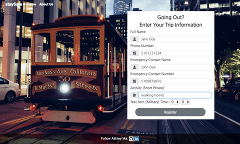
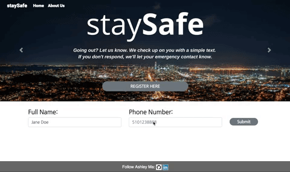
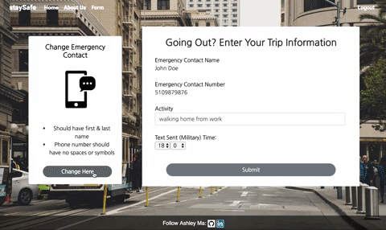

# Stay Safe

## Description
Stay Safe is a messaging system that texts a user's emergency contact if the user does not reply to the site's sms text message within 5 minutes of the sent time.

**First Time Use**



**Login**



**Change Emergency Contact**



## Navigation
* [Tech Stack](#tech-stack)
* [How It Works](#how-it-works)
* [Setup and Installation](#setup)
* [Usage](#usage)

## <a name="tech-stack"></a>Tech Stack
* **Back-End:** Python, Flask, Jinja, SQLAlchemy, PostgreSQL, Schedule
* **APIS:** Google Map, Twilio
* **Front-End:** HTML/CSS, Bootstrap, JQuery, JavaScript, AJAX, React

## <a name="how-it-works"></a>How It Works
A user can register and log back into their account, where their last inputted emergency contact and activity will be shown and saved. If anything in this form needs to be updated, they can update and then submit a time that they want to be texted to be checked on. 

Using Twilio and the schedule library, the app sends a text message to the user at the specified time. If they do not respond within 5 minutes, a text will be scheduled to be sent to their emergency contact with the user’s last activity. Using the Google Maps API, their location will also be sent to the emergency contact if the user allows the browser to request their location.


## <a name="setup"></a>Setup/ Installation
Please be sure to have Python 3.6 and PostgreSQL downloaded before you clone this repository. 

Create a virtual environment:
```
> virtualenv env
> source env/bin/activate
```

Install dependencies:
```
> pip install -r requirements.txt 
```

Create database:
```
$createdb contacts
```

Build database tables and seed file:
```
$ python3 seed.py
```
Run the app via command line:
```
$ python3 server.py
```
**To Receive Texts With Twilio**
* Download Ngrok 
* Run ngrok in your terminal 
```
./ ngrok 5000 
```
* Copy https:// link 
* Paste into Twilio account's messaging request URL + "/sms"

## <a name="usage"></a> Usage 
**Step 1: Register**
* Register via register page
* Enter information
* Allow browser to request your location

**Step 2: Wait For Text**
* Reply to text
* If no reply, a text will be sent to emergency contact


